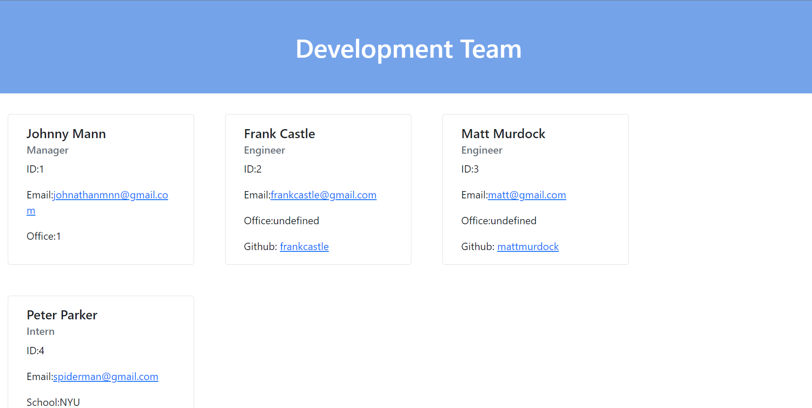

# Team-Profile-Generator

This project was completed for KU's coding boot camp assignment 10. 

The goal of this project was to create a command line application that allows the user to create a team displaying their development team.

## Check out the Project
Check out the different aspects of the project below:

- [Repository](https://github.com/johnathanmann/Team-Profile-Generator/)
- [Video of deployed application](https://watch.screencastify.com/v/VV3JXmXs8pc2UVFEKAzo)

## Install
Feel free to install using GitHubs recommended clone methods or by downloading the code and opening it in your preferred text editor. Once installed use `npm i` to download dependencies.

## Requirements
You need a text editor of your choice, both the inquirer npm and jest, and a browser to view your creation.

## Tests
Tests can be run using npm test

## Summary
This application takes in user input and displays it on an html page. The user can put as many engineers or interns as they please. The questions are asked using [Inquirer](https://www.npmjs.com/package/inquirer), and the tests are done via [Jest](https://www.npmjs.com/package/jest). To run the program input `node index.js` into the command line and answer the prompts.
